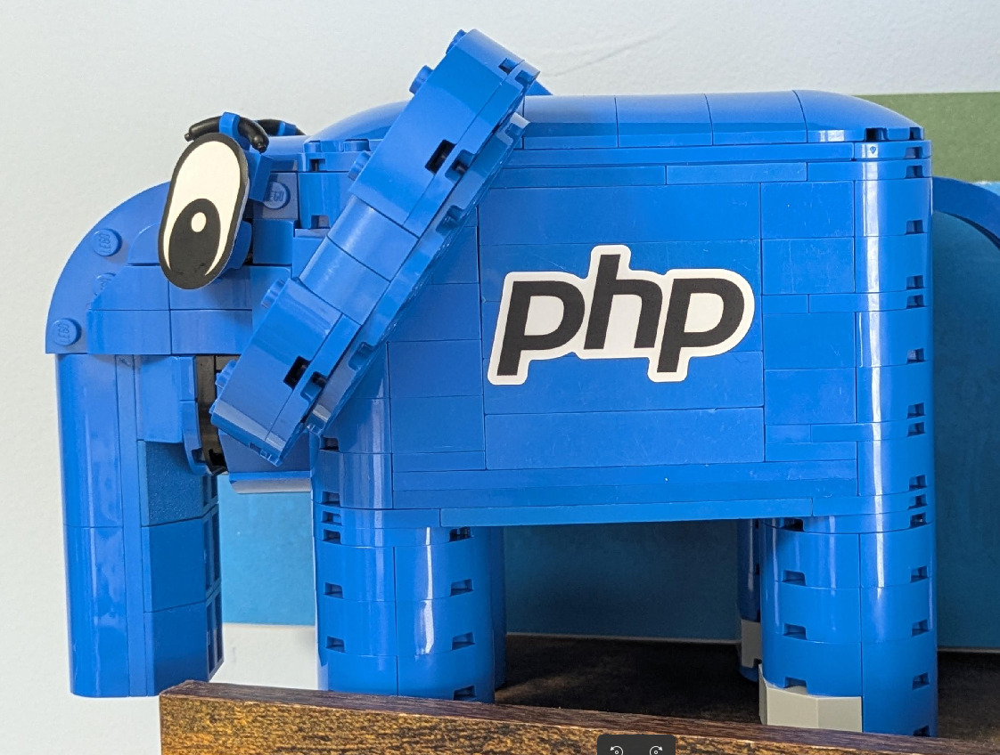
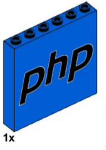

# JetBrains My elePHPant lego set parts list

## Build instructions 

* https://resources.jetbrains.com/storage/products/phpstorm/docs/lego-instruction.pdf

## Parts list

Parts list which can be imported to bricklink.com (inofficial)

[My-elePHPant.xml](My-elePHPant.xml)

### Status

List should be complete, but please verify

### Stickers

Stickers for Eyes and PHP Logo

[stickers.svg](stickers.svg)

I have 6 spare sticker sets ordered from Sticker Mule, you can [contact me](https://self-soft.de/).

### Modification

The [PHP Logo part](https://www.bricklink.com/v2/catalog/catalogitem.page?P=3754&C=7#T=S&C=7&O={%22color%22:%227%22,%22iconly%22:0}) 
is very rare. I replaced it for my elePHPants with additionall 5x 3009 blue bricks.
I did this in [My-elePHPant-modified3009.xml](https://raw.githubusercontent.com/self-soft/elePHPant-lego/refs/heads/trunk/My-elePHPant-modified3009.xml)

## How to order

1. Make an account on [bricklink.com](https://bricklink.com)
2. Go to [wanted list upload](https://www.bricklink.com/v2/wanted/upload.page?utm_content=subnav)
3. Choose the tab *Upload BrickLink XML format*
4. Choose Copy paste [My-elePHPant.xml](https://raw.githubusercontent.com/self-soft/elePHPant-lego/refs/heads/trunk/My-elePHPant.xml) from this repository
5. Hit buy all and have fun to optimize the carts.

## Showroom

Please post your results in the [[discussion thread](https://github.com/self-soft/elePHPant-lego/discussions/2)
